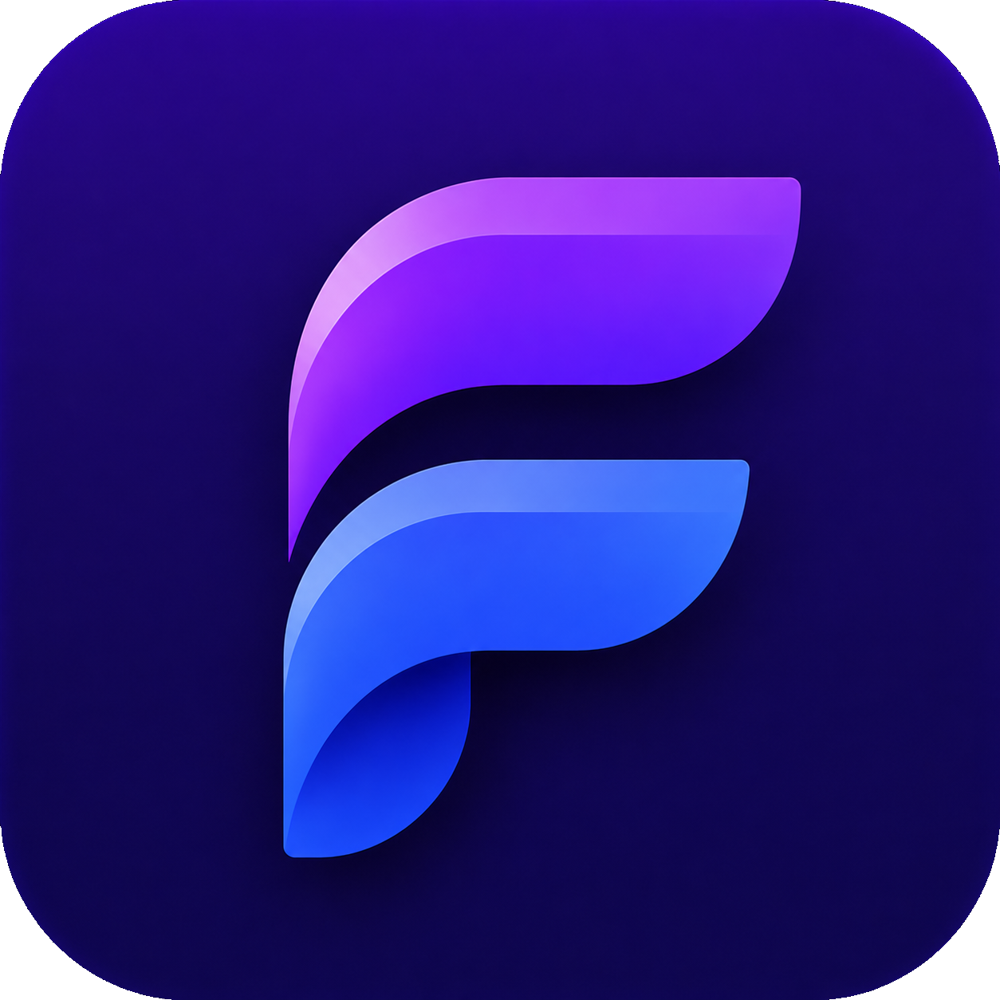

<div align="center">



# CodEx Flow

### O ERP moderno para MEIs, autônomos e pequenas empresas

Sistema SaaS desenvolvido para simplificar a gestão empresarial, reunindo controle de clientes, produtos, estoque, vendas, notas de venda, funcionários e muito mais em uma única plataforma.


</div>

---

# ✨ Sobre

O **CodEx Flow** foi criado para oferecer uma experiência simples, moderna e extremamente intuitiva para empresas que desejam profissionalizar sua gestão sem utilizar ERPs complexos.

O sistema reúne tudo em um único ambiente:

- 📦 Gestão de Produtos
- 👥 Gestão de Clientes
- 💰 Controle Financeiro
- 🛒 PDV
- 📑 Notas de Venda
- 👨‍💼 Funcionários
- ⏰ Controle de Ponto
- 🤖 Chatbot Inteligente
- 📊 Dashboards
- 📈 Relatórios Financeiros

---

# 🚀 Funcionalidades

## 📊 Dashboard

Visualize indicadores importantes da empresa em tempo real.

- Receita
- Vendas
- Clientes
- Produtos
- Financeiro

---

## 👥 Clientes

- Cadastro completo
- Histórico de compras
- Dados de contato
- Pesquisa rápida

---

## 📦 Estoque

Controle completo de estoque.

- Cadastro de produtos
- Quantidade disponível
- Preço de compra
- Preço de venda
- Controle de movimentações

---

## 🛒 PDV

Sistema rápido para vendas.

- Nova venda
- Pesquisa de clientes
- Produtos
- Pagamentos
- Histórico

---

## 💵 Financeiro

Controle financeiro completo.

- Entradas
- Saídas
- Fluxo de caixa
- Relatórios
- Indicadores

---

## 📄 Notas de Venda

Geração automática de notas.

> O sistema gera **Notas de Venda**, não documentos fiscais (NF-e ou NFS-e).

---

## 👨‍💼 Funcionários

- Cadastro
- Cargo
- Informações pessoais
- Integração com ponto eletrônico

---

## ⏰ Controle de Ponto

Integração com sistema de batida de ponto.

- Entrada
- Saída
- Horas trabalhadas

---

## 🤖 Chatbot

Atendimento automatizado.

- Fluxos personalizados
- Respostas automáticas
- Atendimento ao cliente

---

# 🖥️ Tecnologias

## Front-end

- React
- TypeScript
- Vite
- TailwindCSS
- React Router
- Lucide React

---

## Arquitetura

```
src/
│
├── components/
├── pages/
├── routes/
├── services/
├── hooks/
├── context/
├── utils/
├── interfaces/
├── layouts/
└── assets/
```

---

# 🎨 Interface

O projeto utiliza uma interface moderna baseada em:

- Glassmorphism
- Dark Theme
- Componentização
- Layout Responsivo
- Micro animações
- UX focada em produtividade

---

# 📱 Responsividade

✔ Desktop

✔ Notebook

✔ Tablet

✔ Mobile

---

# ⚙️ Instalação

Clone o projeto

```bash
git clone https://github.com/codexsolutions-tech/Codex-Flow-Front.git
```

Entre na pasta

```bash
cd Codex-Flow-Front
```

Instale as dependências

```bash
npm install
```

Execute

```bash
npm run dev
```

Build

```bash
npm run build
```

Preview

```bash
npm run preview
```

---

# 📂 Estrutura do Sistema

```
Dashboard
│
├── PDV
├── Estoque
├── Clientes
├── Vendas
├── Funcionários
├── Financeiro
├── Relatórios
├── Chatbot
└── Configurações
```

---

# 🎯 Público-alvo

- MEIs
- Pequenos Negócios
- Prestadores de Serviço
- Autônomos
- Empresas em crescimento

---

# 💎 Diferenciais

- Interface moderna
- Alta performance
- Fácil utilização
- Fluxos intuitivos
- Sistema modular
- SaaS
- Escalável
- Design Premium

---

# 📌 Roadmap

- [x] Dashboard
- [x] Clientes
- [x] Produtos
- [x] Estoque
- [x] PDV
- [x] Notas de Venda
- [x] Financeiro
- [x] Funcionários
- [x] Controle de Ponto
- [x] Landing Page
- [ ] Integração Bancária
- [ ] API Pública
- [ ] Aplicativo Mobile
- [ ] IA para análise financeira

---

# 👨‍💻 Desenvolvido por

## CodEx Solutions

Transformando ideias em soluções inteligentes.

---

<div align="center">

### ⭐ Se este projeto foi útil, deixe uma estrela no repositório.

**CodEx Flow © 2026**

</div>
